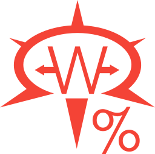
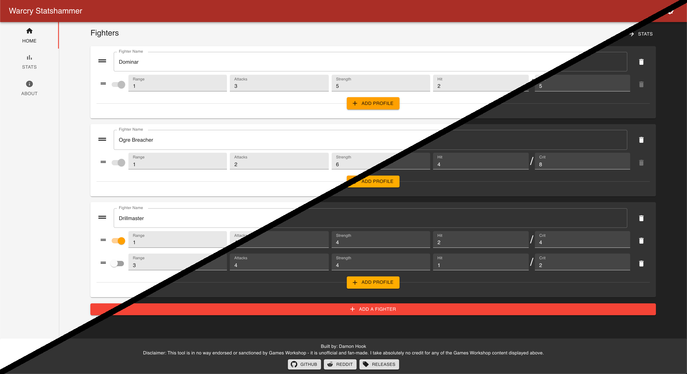
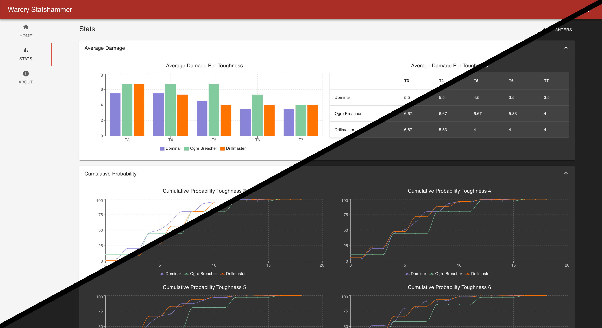

<div align="center">
    <a href="https://warcry-statshammer.herokuapp.com/" target="_blank">
        
    </a>
</div>

# Warcry Statshammer

A tool for calculating and comparing damage outputs for Warhammer Warcry Fighters
(also referred to as Mathhammer).

The production deploy of the tool is located at: https://warcry-statshammer.herokuapp.com/

<div align="center">
    <a href="https://warcry-statshammer.herokuapp.com/" target="_blank">
        
    </a>
</div>

<div align="center">
    <a href="https://warcry-statshammer.herokuapp.com/" target="_blank">
        
    </a>
</div>

## Features

- Average Damage Stats
  - Gather the average damage that each unit is expected to do against various toughness values.
  - This average is a calculated value (not simulated)
- Probabilities
  - Generates **Discrete** and **Cumulative** Probabilities
  - These values are calculated (not simulated)
    - This is done by gathering every permutation of the dice roll(s) and uses that to get a population probability graph
- Dark Theme
- Persisitent data between refreshes
- And more
    - Keep an eye on the [Github Releases](https://www.github.com/damonhook/warcry-statshammer), or the [SubReddit](https://www.reddit.com/r/WarcryStatshammer) to get notified of new additions

## Roadmap Features

- Choose from a preset list of fighters
- Export PDF
- Google Drive integration
  - Save / Load Fighters

## Related Projects

- [AoS Statshammer](https://github.com/damonhook/aos-statshammer)
  - Provides similar functionality to this, but for Warhammer Age of Sigmar

## Installation

Ensure that you have `node`, `yarn`, and `nodedeamon` installed.

Install the packages needed for the express server (backend) and the client (frontend)

```bash
yarn setup
```

## Usage

### `yarn dev`

Runs the app in development mode (launches both the express server, and the react frontend).

Open http://localhost:3000 to view it in the browser

### `yarn test`

Runs the api tests. Please make sure you run this whenever you make any changes to the api / backend

### Contributing

Pull requests are welcome. For major changes, please open an issue first to discuss what you would like to change.

